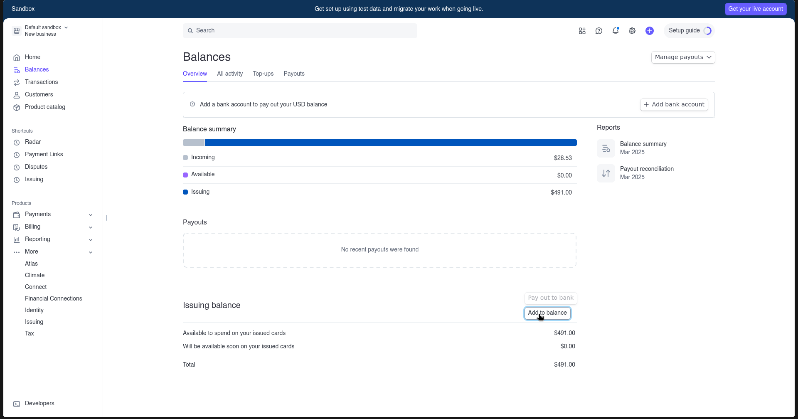
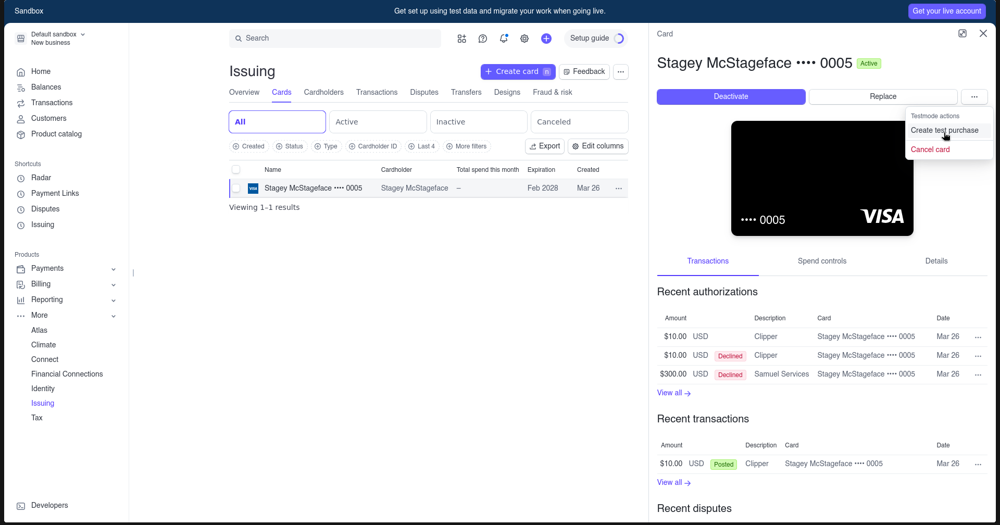

# Stripe Testing

A range of HCB's features are built using Stripe; including donations, invoices and issued cards. Fortunately, Stripe has amazing developer tools which allow you to use it in development very easily.

## Getting setup

We recommend creating a US Stripe account in "test mode". Read more here: [docs.stripe.com/test-mode](https://docs.stripe.com/test-mode#test-mode). Once you create a Stripe account, you'll be in the default sandbox.

Now that you have a Stripe account, go to the Developers menu in the bottom-left corner and click on API keys. You'll need a publishable key and a secret key - create and copy both of these into the `.env.development` file, with the names `STRIPE__TEST__PUBLISHABLE_KEY` and `STRIPE__TEST__SECRET_KEY`, respectively. Remember that if you're using the devcontainer (such as with GitHub Codespaces), you must rebuild the container after modifying the `.env.development` file to pull in the new variables.

The last thing you'll need to do whenever you're testing with Stripe is configure webhooks. Every time an action happens on Stripe, like a card charge, a webhook is sent to HCB. Since your development instance of HCB isn't publicly available, you'll need to run the local listener. [Install the Stripe CLI](https://stripe.com/docs/stripe-cli#install) and start the listener with:

```
stripe listen --forward-to localhost:3000/stripe/webhook
```

### Stripe Issuing

We use Stripe Issuing to issue virtual and physical credit cards to users. It requires a little more setup to get started. Head over to the [Issuing tab](https://dashboard.stripe.com/test/issuing/overview) on the Stripe dashboard (it's hidden under "More" in the sidebar), and enable it. You'll then need to add funds to your Issuing Balance, which you can do in the [Balances tab](https://dashboard.stripe.com/test/balance/overview#issuing-summary). Click on "Add to balance" in the Issuing balance section, and add up to $2,500. It's all fake money in test mode!



Once you've started the transfer, it may take some time for the money to actually be available to spend on issued cards.

## Spending money

Once you're setup, you can use most of HCB's Stripe features like normal! Read more for details on specific features.

### Donations

For donating money in development, use card number `4242 4242 4242 4242`, with any 3 digits for the CVC and any future date as the expiration date. You can also browse [other test cards](https://docs.stripe.com/testing?testing-method=card-numbers#cards) if you'd like to simulate a different card brand or country. As long as your local webhook listener is running, the donation should immediately appear in HCB after you submit.

### Card transactions

Stripe also lets you simulate charges on an issued card! First, issue a virtual card from HCB. Then, go into the Stripe dashboard, and go to the [Cards tab in Stripe Issuing](https://dashboard.stripe.com/test/issuing/cards). There, you should be able to see all the cards you've issued. Click on the card you'd like to charge, and then click on "Create test purchase" in the three-dots menu that appears.



From here, you can fill out any data you wish - most is optional. If you'd like to simulate a charge from a specific merchant, check out the [`yellow_pages` merchants file](https://github.com/hackclub/yellow_pages/blob/main/lib/yellow_pages/merchants.yaml) - this contains network IDs for a ton of common merchants.

Note that this will only create an authorization, which is not the actual transaction. It will show up as a pending transaction on the transactions page. Stripe will let you capture the authorization by pressing the "Capture" button in the top-right after creating the authorization. Once you capture, you must run `TransactionEngine::NightlyJob` for HCB to mark the transaction as settled - you can do this in the Rails console:

```ruby
TransactionEngine::NightlyJob.perform_now
```

For more information on how card transactions work, see [the card transactions guide](./guides/card_transactions.md).
